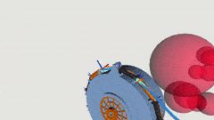

# Open-Source Planning Framework for Coiled Cable-Driven Hyper-Redundant Manipulators (C-CDHRM)
> Other language versions: <a href="https://github.com/HILMR/C-CDHRM/blob/main/README_ZH.md">中文版</a>
## Introduction

The coiled hyper-redundant cable-driven manipulator (C-CDHRM) is a new type of manipulator inspired by the structure and behavior of snakes. It can complete operating tasks in narrow and closed environments with a compact device volume and highly flexible motion capabilities. However, the kinematic planning of C-CDHRM faces the following challenges:

- Cable driving leads to multiple non-linear mapping relationships from workspace to actuation space
- Hyper-redundant degrees of freedom leads to multiple solutions in kinematics
- Complex structures and environments lead to restricted movement under the combined effects of multiple constraints

Thanks to the rotatable base, C-CDHRM can not only achieve conventional point-to-point motion (Figure A) but also bionic-inspired following motion (Figure B). The former is conducive to operation, and the latter is conducive to exploration. The two motion modes can complement each other's advantages.


This project will gradually open source the planning framework for C-CDHRM and the solving algorithms required for the above two motion modes, so stay tuned!

## ROS package: OpenCDHRM

> Please see detailed instructions: <a href="https://github.com/HILMR/C-CDHRM/blob/main/OpenCDHRM/README.md">Package Readme</a>

The open-source project `OpenCDHRM` aims to provide a general planning framework to solve kinematic problems for different motion configurations and modes in Cable-Driven Hyper-Redundant Manipulators (CDHRM), and provide different SOTA algorithms, ultimately achieving efficient and convenient CDHRM engineering development and scientific research.



### TODO List

- Adapt to different CDHRM configurations
    - [ ] Fixed base
    - Feeding base
        - [ ] Linear slide `L-CDHRM`
        - [x] Rotating base `C-CDHRM`
        - [ ] Mobile platform `M-CDHRM`
        - [ ] Combined feeding device
- Add diverse SOTA solving methods for different motion modes
    - Point-to-point Motion: Inverse kinematics (IK) Solvers
        - [ ] Jacobian numerical method
        - [ ] Geometric method
        - [ ] Geometric iteration method: `MCKP`
    - Following Motion: Follow-the-Leader (FTL) Strategy
        - [ ] Search method
        - [x] Geometric method: `SCP-FTL`

## Application Examples

#### Teleoperation Platform


#### Point-to-Point Solver: Fixed Point Operation
<figure class="half">
    
    
</figure>

#### Follow-the-Leader Solver: Environment Exploration
<figure class="half">
    
    
</figure>

## Acknowledgments

If our code is helpful for your work, please cite the following paper:
You can also find more technical details in the following papers.

``` Bibtex
@article{TMECH2023CCDHRM,
  title = {A Bioinspired Coiled Cable-Driven Manipulator: Mechatronic Design and Kinematics Planning With Multiconstraints},
  shorttitle = {A Bioinspired Coiled Cable-Driven Manipulator},
  author = {Luo, Mingrui and Li, En and Zhang, Aoshun and Tan, Min and Liang, Zize},
  year = {2023},
  journal = {IEEE/ASME Transactions on Mechatronics},
  pages = {1--12},
  issn = {1941-014X},
  doi = {10.1109/TMECH.2023.3257481},
}
```

``` Bibtex
@inproceedings{LuoIROS2023,
  title = {A Novel Coiled Cable-conduit-driven Hyper-redundant Manipulator for Remote Operating in Narrow Spaces},
  booktitle = {2023 IEEE/RSJ International Conference on Intelligent Robots and Systems (IROS)},
  author = {Luo, Mingrui and Tian, Yunong and Li, En and Chen, Minghao and Tan, Min and others},
  date = {2023-10},
}
```
