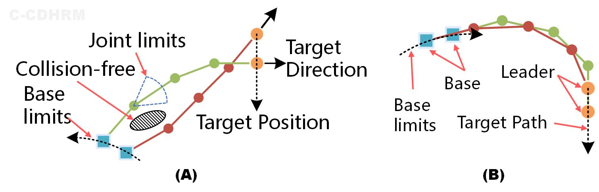

# 蜷缩式超冗余线缆驱动机械臂 (C-CDHRM) 开源规划框架
> 其他语言版本: <a href="./README.md">English</a>
## 引言
蜷缩式超冗余度线缆驱动机械臂(C-CDHRM)是一种受蛇结构和行为启发的新型机械臂，能够以紧凑的装置体积和高度灵活的运动能力完成狭窄封闭环境下的作业任务。但是，C-CDHRM的运动学规划面临如下挑战：
- 线缆驱动导致工作空间至执行空间存在多重非线性映射关系
- 超冗余自由度导致运动学存在多解性
- 复杂结构和环境导致在多约束条件综合作用下的受限运动

得益于可转动的基座，因此C-CDHRM除了能够实现常规的点到点运动（图A），还能够实现仿生启发的跟随运动（图B）。前者利于作业，后者利于探索，两种运动模式能够实现优势互补。



本项目将逐步开源用于C-CDHRM的规划框架和上述两种运动模式所需的求解算法，敬请关注！

## ROS包: OpenCDHRM
> 详细说明请查看: <a href="./OpenCDHRM/README.md">包说明</a>

### 简介
开源项目`OpenCDHRM`旨在提供一种通用规划框架以求解CDHRM中不同的运动构型和模式下的运动学问题，并提供不同的SOTA算法，最终实现CDHRM工程开发和科学研究的高效、便捷。


### 当前和未来的工作

适配不同的CDHRM构型
- [ ] 固定基座
- 进给基座
    - [ ] 线性滑台：`L-CDHRM`
    - [X] 旋转基座：`C-CDHRM`
    - [ ] 移动平台：`M-CDHRM`
    - [ ] 组合式进给装置

为不同的运动模式添加多样化的SOTA求解方法

- 点到点运动：逆运动学规划 (`IK Solver`)
    - [ ] 雅可比数值方法
    - [ ] 几何法
    - [ ] 几何迭代方法：`MCKP`
- 跟随运动：跟随领导者策略 (`FTL Solver`)
    - [ ] 搜索法
    - [X] 几何法：`SCP-FTL`

## 应用范例

#### 遥操作平台


#### 点到点求解器:定点运动
<figure class="half">
    
    
</figure>

#### 跟随领导者求解器:环境探索
<figure class="half">
    
    
</figure>

## 致谢

如果我们的代码对您的工作有所帮助，请引用下列论文：
更多的技术细节您也可以在下列论文中找到。

``` Bibtex
@article{TMECH2023CCDHRM,
  title = {A Bioinspired Coiled Cable-Driven Manipulator: Mechatronic Design and Kinematics Planning With Multiconstraints},
  shorttitle = {A Bioinspired Coiled Cable-Driven Manipulator},
  author = {Luo, Mingrui and Li, En and Zhang, Aoshun and Tan, Min and Liang, Zize},
  year = {2023},
  journal = {IEEE/ASME Transactions on Mechatronics},
  pages = {1--12},
  issn = {1941-014X},
  doi = {10.1109/TMECH.2023.3257481},
}
```

``` Bibtex
@inproceedings{LuoIROS2023,
  title = {A Novel Coiled Cable-conduit-driven Hyper-redundant Manipulator for Remote Operating in Narrow Spaces},
  booktitle = {2023 IEEE/RSJ International Conference on Intelligent Robots and Systems (IROS)},
  author = {Luo, Mingrui and Tian, Yunong and Li, En and Chen, Minghao and Tan, Min and others},
  date = {2023-10},
}
```